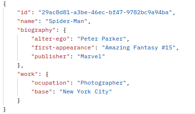

## GOLANG REST API
This project is a simple Superheroes REST API. The API allows basic operations such as retrieving a list of all superheroes, fetching an superheroe by its ID, and creating new superheroes. It is built in the Go programming language using the Gin-gonic tool.

  

